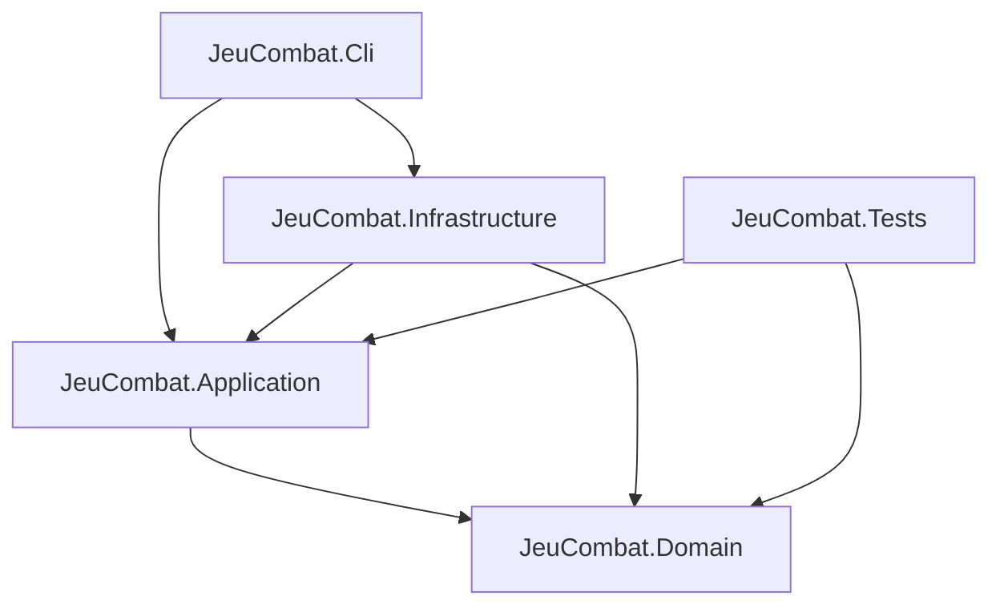
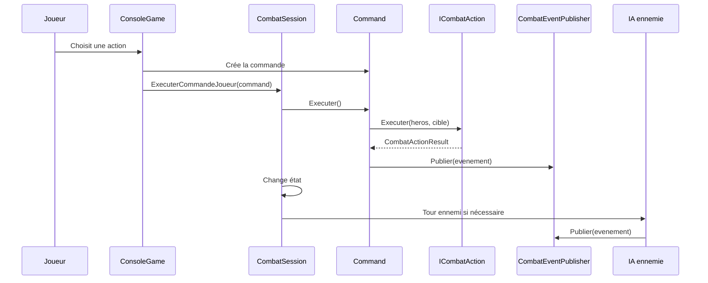
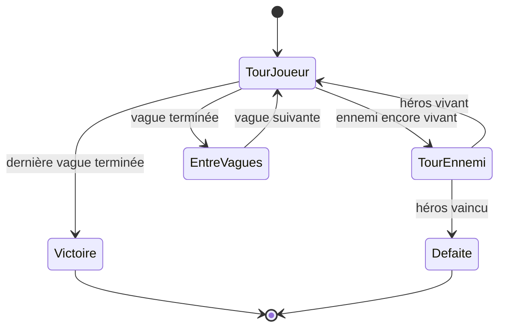

# Architecture du projet JeuCombat

## Objectif

Le projet `JeuCombat` est une application console C# de combat tour par tour.

L'architecture est volontairement séparée en couches afin de garder un code lisible, testable et maintenable.

## Vue globale

```txt
JeuCombat
├── Domain
├── Application
├── Infrastructure
└── Cli
```

## Diagramme des dépendances



## Rôle des couches

### Domain

La couche `Domain` contient le coeur métier du jeu.

Elle ne dépend d'aucune autre couche.

Elle contient :

- les entités du jeu ;
- les enums métier ;
- les constantes des règles de combat ;
- les comportements métier simples.

Exemples :

```txt
Personnage
Heros
Ennemi
Vague
ClasseHero
TypeEnnemi
CombatRules
```

### Application

La couche `Application` contient l'orchestration du jeu.

Elle utilise le domaine, mais ne connaît pas la console.

Elle contient :

- les actions de combat ;
- les commandes joueur ;
- les états du combat ;
- la session de combat ;
- les factories ;
- l'IA ennemie ;
- les événements ;
- le journal de combat.

### Infrastructure

La couche `Infrastructure` contient les détails techniques.

Actuellement, elle contient l'interface console.

Elle est responsable de :

- lire les entrées utilisateur ;
- afficher l'état du combat ;
- afficher les menus ;
- afficher les événements du combat.

### Cli

La couche `Cli` est le point d'entrée.

Elle contient uniquement `Program.cs`.

Son rôle est d'assembler les composants et de lancer le jeu.

## Diagramme simplifié du combat



## Machine à états

Le combat est contrôlé par le pattern State.



## Patterns utilisés

### Strategy

Utilisé pour les actions de combat.

```txt
ICombatAction
├── AttaqueBasiqueAction
├── SoinAction
├── CompetenceGuerrierAction
├── CompetenceMageAction
└── CompetenceVoleurAction
```

Avantage :

- ajouter une nouvelle action sans modifier la console ;
- tester chaque action indépendamment ;
- éviter un gros `switch` dans le menu.

### Strategy pour l'IA

Utilisé pour l'IA ennemie.

```txt
IEnnemiAiStrategy
└── AttaqueSimpleEnnemiAiStrategy
```

Avantage :

- `CombatSession` ne calcule pas directement l'attaque ennemie ;
- on peut ajouter plus tard une IA plus avancée.

### State

Utilisé pour représenter les phases du combat.

```txt
ICombatState
├── TourJoueurState
├── TourEnnemiState
├── EntreVaguesState
├── VictoireState
└── DefaiteState
```

Avantage :

- éviter une boucle de combat trop complexe ;
- isoler les comportements liés aux phases du combat.

### Factory

Utilisé pour créer les objets du jeu.

```txt
IHerosFactory
HerosFactory

IEnnemiFactory
EnnemiFactory

IVagueFactory
VagueFactory
```

Avantage :

- centraliser les statistiques ;
- éviter de répéter les `new Heros(...)` et `new Ennemi(...)` partout ;
- simplifier la création des vagues.

### Command

Utilisé pour encapsuler les choix du joueur.

```txt
ICommand
├── AttaquerCommand
├── UtiliserCompetenceCommand
├── SoignerCommand
└── AfficherJournalCommand
```

Avantage :

- séparer la saisie utilisateur de l'exécution métier ;
- préparer une éventuelle évolution vers un replay ou un historique d'actions.

### Observer

Utilisé pour diffuser les événements de combat.

```txt
CombatEventPublisher
├── InMemoryCombatJournal
└── ConsoleCombatObserver
```

Avantage :

- découpler les actions de l'affichage console ;
- permettre plusieurs réactions à un même événement ;
- garder un journal de combat sans coupler les actions au journal.

## Choix de nommage

Le projet utilise principalement des noms métier en français :

```txt
Heros
Ennemi
Vague
AttaquerCommand
SoignerCommand
```

Les noms liés aux patterns ou aux couches restent proches des termes techniques habituels :

```txt
Domain
Application
Infrastructure
Strategy
Command
Observer
Factory
State
```

Ce choix est cohérent avec le sujet du TP, qui est rédigé en français.

## Principes SOLID appliqués

### Single Responsibility Principle

Chaque classe a une responsabilité claire.

Exemples :

- `ConsoleRenderer` affiche.
- `ConsoleInputReader` lit les entrées.
- `CombatSession` orchestre le combat.
- `AttaqueBasiqueAction` exécute une attaque de base.
- `HerosFactory` crée des héros.

### Open/Closed Principle

On peut ajouter une nouvelle action en créant une nouvelle classe qui implémente `ICombatAction`.

On peut ajouter une nouvelle IA en créant une nouvelle classe qui implémente `IEnnemiAiStrategy`.

### Liskov Substitution Principle

Les implémentations de `ICombatAction`, `ICommand`, `ICombatState` et `ICombatObserver` respectent leur contrat.

### Interface Segregation Principle

Les interfaces sont petites et ciblées :

```txt
ICombatAction
ICommand
ICombatState
ICombatObserver
ICombatJournal
IConsoleRenderer
IConsoleInputReader
```

### Dependency Inversion Principle

Les classes de haut niveau dépendent d'interfaces plutôt que d'implémentations concrètes quand c'est pertinent.

Exemples :

```txt
CombatSession -> ICombatEventPublisher
CombatSession -> IEnnemiAiStrategy
ConsoleGame -> IConsoleInputReader
ConsoleGame -> IConsoleRenderer
```

## Tests

Les tests sont placés dans :

```txt
tests/JeuCombat.Tests/
```

Ils couvrent :

- le domaine ;
- les factories ;
- les actions ;
- les commandes ;
- les événements ;
- les états ;
- l'IA ennemie ;
- les scénarios complets.

Les tests ne dépendent pas de la console, afin de garder une logique métier testable.

## Évolutions possibles

### Repository JSON

Un bonus possible serait d'ajouter un système de sauvegarde des scores.

Classes possibles :

```txt
Score
IScoreRepository
JsonScoreRepository
```

Cela permettrait d'utiliser le pattern Repository en bonus.

### IA ennemie avancée

On pourrait ajouter :

```txt
AttaquePuissanteEnnemiAiStrategy
AttaqueAleatoireEnnemiAiStrategy
```

### Nouveaux héros

On pourrait ajouter une classe de héros sans modifier la boucle de combat.

Exemple :

```txt
Paladin
Archer
Necromancien
```

### Nouveaux ennemis

On pourrait enrichir la factory ennemie avec :

```txt
Troll
SorcierNoir
Dragon
```
